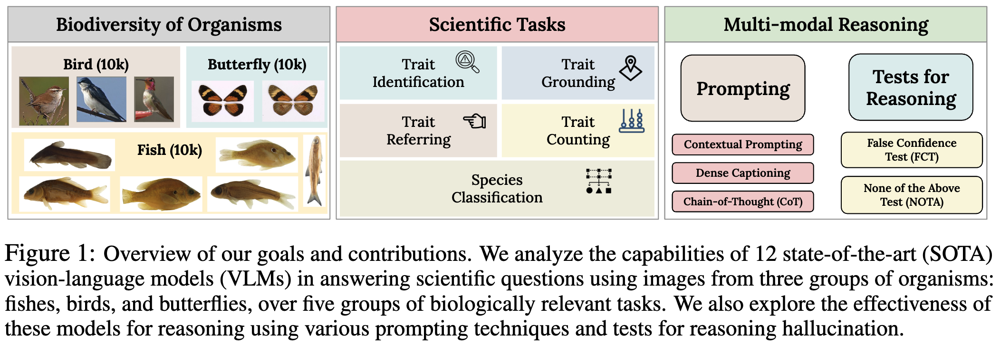
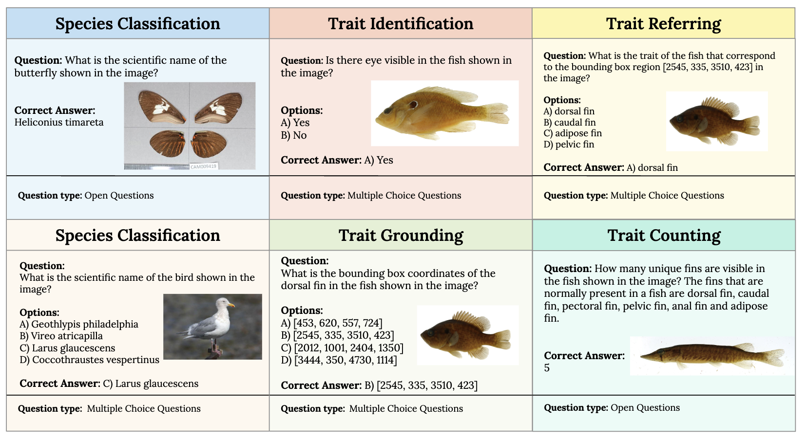
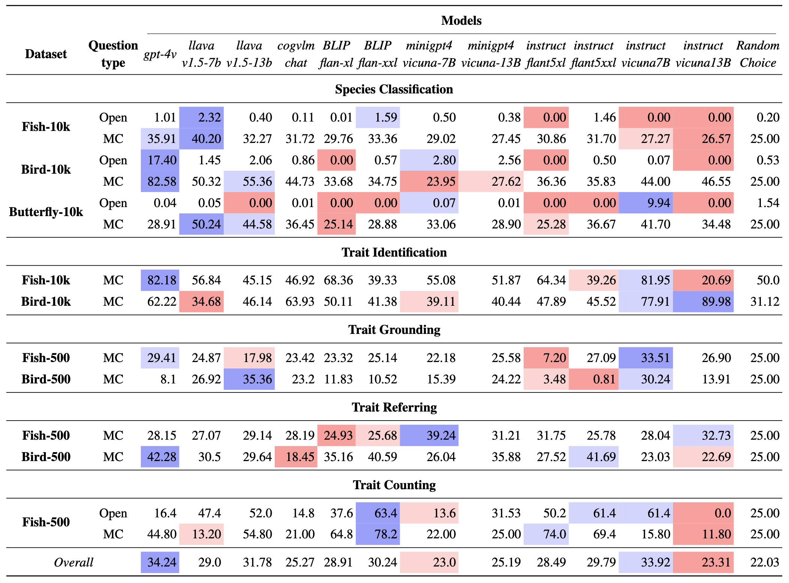

# VLM4Bio
[[**🤗 HF Dataset**](https://huggingface.co/datasets/imageomics/VLM4Bio)]  |  [[**🔒 License Information**](https://huggingface.co/datasets/imageomics/VLM4Bio#licensing-information)] | [[**♠️ Dataset Card**](https://huggingface.co/datasets/imageomics/VLM4Bio#dataset-card-for-vlm4bio)]

This repository contains the full pipeline and evaluation code for the paper **"[VLM4Bio: A Benchmark Dataset to Evaluate Pretrained Vision-Language Models for Trait Discovery from Biological Images.](https://arxiv.org/abs/2408.16176)"**



## Abstract
Images are increasingly becoming the currency for documenting biodiversity on the planet, providing novel opportunities for accelerating scientific discoveries in the field of organismal biology, especially with the advent of large  vision-language models (VLMs). We ask if pre-trained VLMs can aid scientists in answering a range of biologically relevant questions without any additional fine-tuning. In this paper, we evaluate the effectiveness of 12 state-of-the-art (SOTA) VLMs in the field of organismal biology using a novel dataset, **VLM4Bio**, consisting of $~469K$ question-answer pairs involving $30K$ images from three groups of organisms: fishes, birds, and butterflies, covering five biologically relevant tasks. We also explore the effects of applying prompting techniques and tests for reasoning hallucination on the performance of VLMs, shedding new light on the capabilities of current SOTA VLMs in answering biologically relevant questions using images.


## Tasks

We conducted our evaluation on five scientific tasks relevant to biologists in the study of biodiversity science. Tasks are: **Species Classification, Trait Identification, Trait Grounding, Trait Referring, Trait Counting**.

## Datasets

| **Fish-10K**| | **Bird-10K** | | **Butterfly-10K**  | |
|----------|----------|----------|----------|----------|----------|
| **Statistics** | **Number** | **Statistics** | **Number** | **Statistics** | **Number** |
|Images | 10,347 | Images | 11,092 | Images | 10,013 |
|Species | 495 | Species | 188 | Species | 60 |
|Genera | 178 | Genera | 114 | Genera | 27 | 


We used image collections of three taxonomic groups of organisms: Fish (contained $10K$ images), Bird (containing $10K$ images), and Butterfly (containing $10K$ images). The motivation for choosing these datasets is to evaluate the effectiveness of VLMs in answering biological questions over a range of bio-diverse organisms.

## Download Datasets
The datasets can be downloaded from this [repository](https://huggingface.co/datasets/imageomics/VLM4Bio):

Download the dataset and order the files like the following in the ```data/``` folder.

```
data/
└── VLM4Bio/
    └── datasets/
        ├── Fish/
        │   ├── images/
        │   │   ├── INHS_FISH_58870.jpg
        │   │   ├── INHS_FISH_58819.jpg
        │   │   └── ...
        │   └── metadata/
        │       ├── metadata_10k.csv
        │       ├── metadata_500.csv
        │       └── ...
        ├── Bird/
        │   ├── images/
        │   │   ├── Ivory_Gull_0117_49227.jpg
        │   │   ├── Yellow_Warbler_0026_176337.jpg
        │   │   └── ...
        │   └── metadata/
        │       ├── bird_metadata_10k.csv
        │       ├── identification.csv
        │       └── ...
        └── Butterfly/
            ├── images/
            │   ├── butterfly_train_heliconius_sara_0007.jpg
            │   ├── butterfly_val_pyrrhogyra_cramen_0001.jpg
            │   └── ...
            └── metadata/
                ├── metadata.csv
                └── imagelist.csv
```

## Setting up Environments
We used multiple environments to run the VLMs. One should follow the setting up environment instructions of the VLM repositories to set up the environments.
| Environments | Models | Instruction |
|----------|----------|----------|
| llava | llava-v1.5-7b, llava-v1.5-13b, gpt-4v | [link](https://github.com/haotian-liu/LLaVA?tab=readme-ov-file#install) |
| vlm_env | cogvlm-chat | [link](https://github.com/THUDM/CogVLM?tab=readme-ov-file#option-2deploy-cogvlm--cogagent-by-yourself) |
| minigptv | minigpt4-vicuna-7B, minigpt4-vicuna-13B | [link](https://github.com/Vision-CAIR/MiniGPT-4?tab=readme-ov-file#installation)|
| blip | blip-flan-xl, blip-flan-xxl | [link](https://github.com/salesforce/BLIP?tab=readme-ov-file#blip-bootstrapping-language-image-pre-training-for-unified-vision-language-understanding-and-generation) |
| instruct_blip | instruct-vicuna7b, instruct-vicuna13b, instruct-flant5xl, instruct-flant5xxl | [link](https://github.com/salesforce/LAVIS/blob/main/projects/instructblip/README.md#install-from-source) |

You may need to additionally install ```imageio, openai, jsonlines``` depending on the environment. 

### Running GPT-4V(ision)
If you want to evaluate the performance of the GPT-4V or GPT-4o model, you need to provide your Openai API keys in ```gpt_api/api_key.txt``` and ```gpt_api/org_key.txt```.

## Results



## Evaluation

To evaluate the performance of ```gpt-4v``` on the VLM4Bio Fish-10K dataset for **Species Classification** tasks and multiple-choice **(MC)** question-type, we run the following codes.

```
python zero_shot_eval/classification.py -m "gpt-4v" -t "selection" -d "fish" -c 0
python zero_shot_eval/classification.py -m "gpt-4v" -t "selection" -d "fish" -c 1
python zero_shot_eval/classification.py -m "gpt-4v" -t "selection" -d "fish" -c 2
python zero_shot_eval/classification.py -m "gpt-4v" -t "selection" -d "fish" -c 3
python zero_shot_eval/classification.py -m "gpt-4v" -t "selection" -d "fish" -c 4
python zero_shot_eval/classification.py -m "gpt-4v" -t "selection" -d "fish" -c 5
python zero_shot_eval/classification.py -m "gpt-4v" -t "selection" -d "fish" -c 6
python zero_shot_eval/classification.py -m "gpt-4v" -t "selection" -d "fish" -c 7
python zero_shot_eval/classification.py -m "gpt-4v" -t "selection" -d "fish" -c 8
python zero_shot_eval/classification.py -m "gpt-4v" -t "selection" -d "fish" -c 9
```
We divide the full dataset into 10 chunks, hence we run 10 scripts to collect the VLM responses. In our code, we define ```Open``` questions as "direct" and ```MC``` questions as "selection" type. 

Scripts regarding other tasks and evaluations have been provided in the ```scripts``` folder.

The evaluation notebook to visualize and compare the results are in the ```Evaluation/``` folder.

## Citation
Please refer to our [dataset card citation section](https://huggingface.co/datasets/imageomics/VLM4Bio#citation).

**BibTeX:**
Please be sure to cite the paper and _all_ dataset sources if you use the dataset.


```bibtex
@article{maruf2024vlm4bio,
  title={VLM4Bio: A Benchmark Dataset to Evaluate Pretrained Vision-Language Models for Trait Discovery from Biological Images},
  author={M. Maruf and Arka Daw and Kazi Sajeed Mehrab and Harish Babu Manogaran and Abhilash Neog and Medha Sawhney and Mridul Khurana and James P. Balhoff and Yasin Bakis and Bahadir Altintas and Matthew J. Thompson and Elizabeth G. Campolongo and Josef C. Uyeda and Hilmar Lapp and Henry L. Bart and Paula M. Mabee and Yu Su and Wei-Lun Chao and Charles Stewart and Tanya Berger-Wolf and Wasila Dahdul and Anuj Karpatne},
  year={2024},
  eprint={2408.16176},
  archivePrefix={arXiv},
  primaryClass={cs.CV},
  url={https://arxiv.org/abs/2408.16176}, 
}
```
